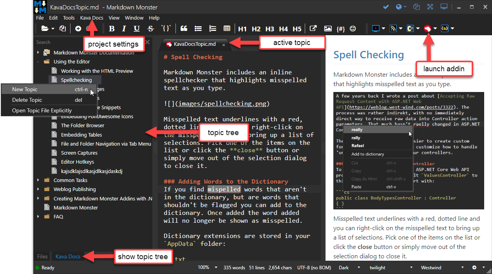

# Easy Documentation Generation from Markdown

Kava Docs is a multi-source documentation framework that allows you serve up documentation from a variety of sources.

The most common way to use Kava Docs is to use a **Git Repository** containing **Markdown Files** along with an optional JSON based table of contents. Kava Docs serves this content from your repo or the file system using a clean and customizable layout engine that serves beautiful docs with minimal effort.

### Markdown Monster Addin
This addin provides a Visual Interface for managing the table of contents with a rich tree editor that makes it easy to browser, add and delete topics and edit them interactively. Additionally there are many helper tools that facilitate importing things like components and other things.

Markdown Monster provides all the markdown editing features you've come to love in the tool, and the Kava Docs addin provides additional tooling for making it easy to manage your help topics.